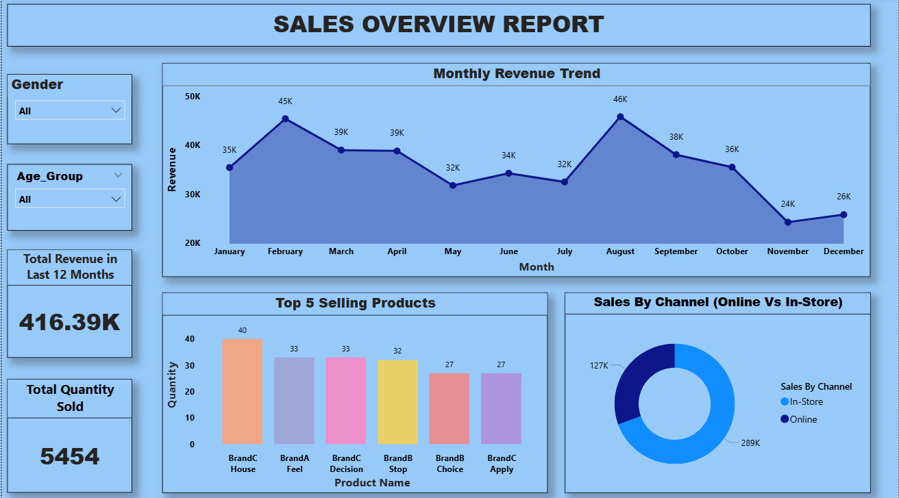
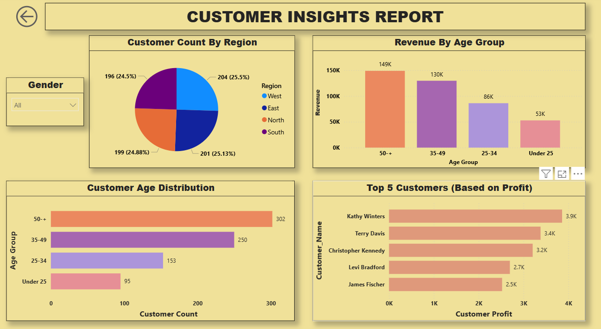
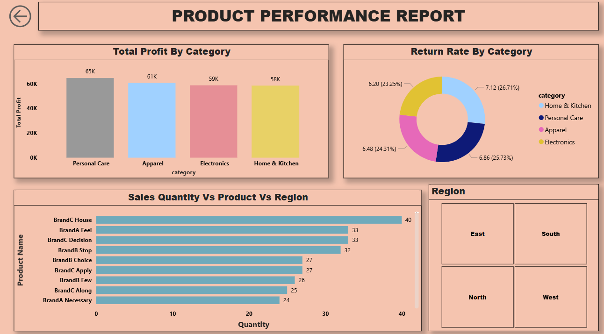
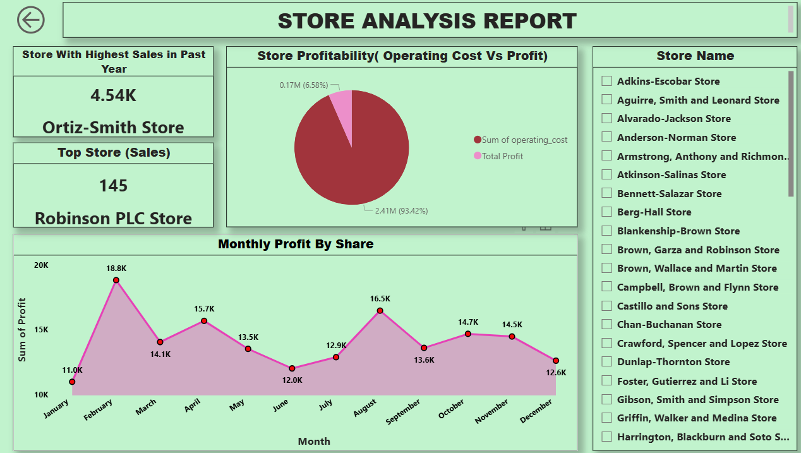
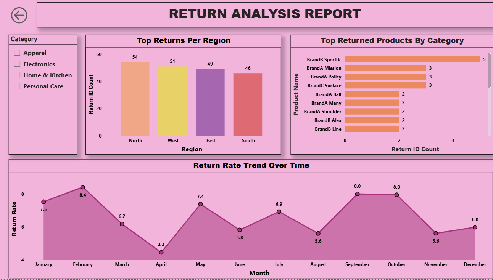

# retail-sales-performance-and-behavioral-analytics
Analysis of retail sales and customer buying behavior

## About
This project looks at retail sales data to understand how sales change over time and how customers buy products

## What I Did
-Cleaned datasets using python
-Used SQL to query and filter data
-Created dashboards in Power BI
-Found sales trends and customer patterns

## Data
-raw/ --> original datasets
-cleaned/--> processed datasets after cleaning

## Dashboard Preview

### Sales Overview

### Customer Analysis

### Product Performance

### Store Analysis

### Returns Analysis

## Tools used
-Pyhton
-SQL
-Power BI

## Key Results
- Identified top-selling products
- Found busy sales periods
- Understood customer buying behaviour

- ## How to Run
1. Open the notebook(python)
2. Run SQL queries
3. View dashboard in Power BI
